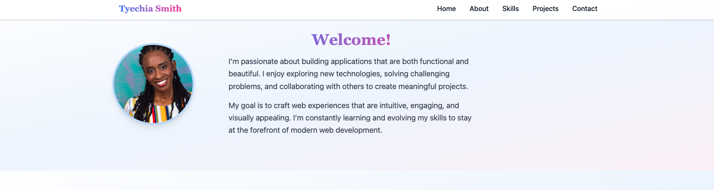
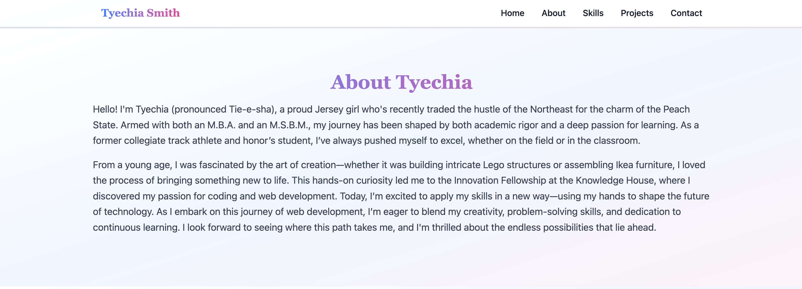
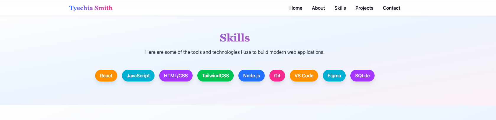
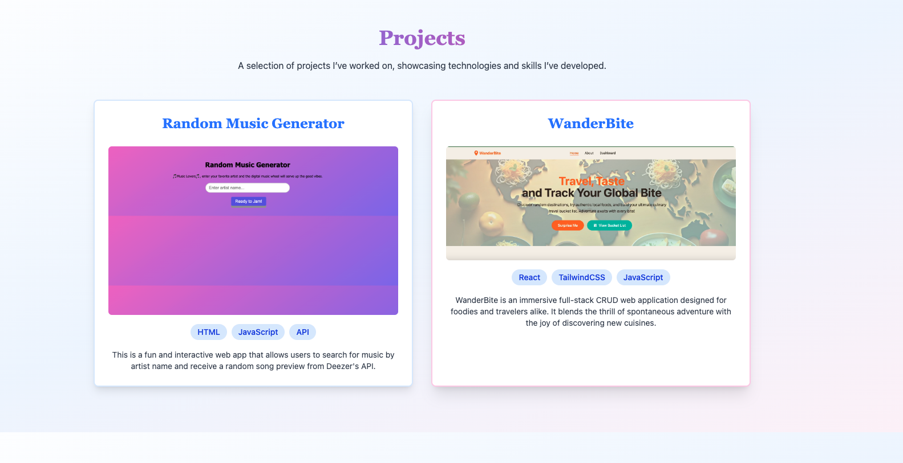
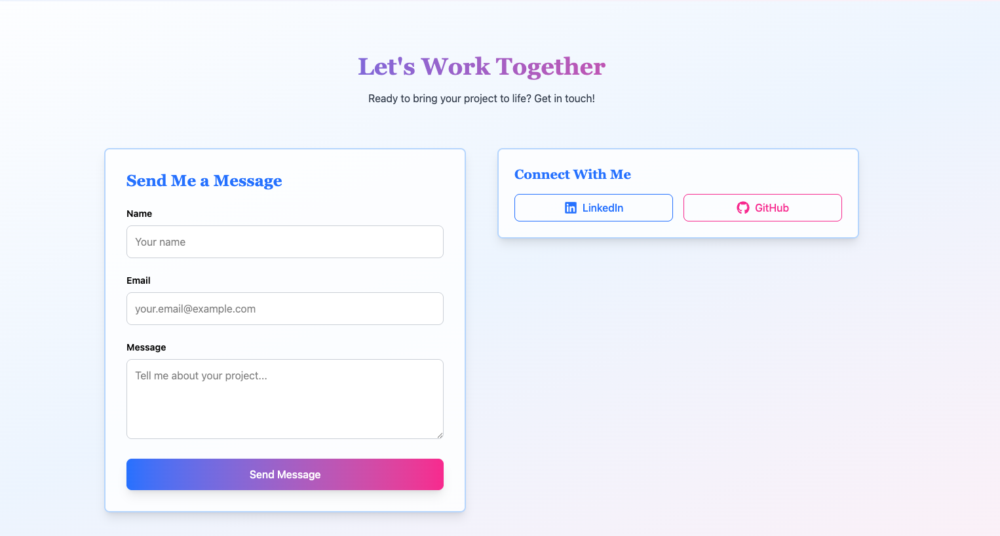

# Tyechia Smith Portfolio

A modern, single-page portfolio showcasing the skills, projects, and experience of Tyechia Smith. Built with **React**, **TailwindCSS**, and **Vite**, this portfolio demonstrates a clean, responsive design with interactive components.

---

## About the Project

This portfolio is designed to highlight Tyechia Smith’s skills, projects, and professional background. It includes:

- **Navigation bar** with smooth scrolling to each section. 
- **Home section** with profile image and welcome.  
- **About section** with background information.  
- **Skills section** showcasing key technologies.  
- **Projects section** displaying projects with technologies and competencies.  
- **Contact section** with a form and social links.  

The design uses gradient headings, card-style sections, and responsive layouts to provide a modern look and feel.

---

## Features

- Fully **responsive design** for desktop and mobile.  
- Gradient-themed headings and navigation.  
- **Project cards** with images, technologies, and skills.  
- Interactive badges for skills and technologies.  
- Contact form with social links.  
- Clean, modern UI using **TailwindCSS**.  

---

## Technologies Used

- React
- TailwindCSS
- Vite
- React Icons

---

## Screenshots

